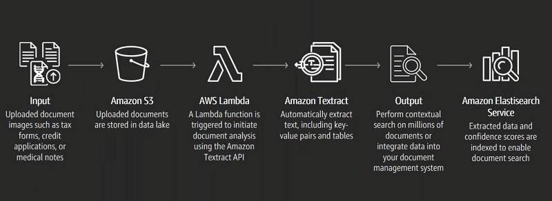

<div id="top"></div>

<br />
<div align="center">
  <h1 align="center">Extract text with AWS Textract for Driver License</h1>
  

  <br />
  
  <p align="center">
    Amazon Textract enables you to add document text detection and analysis to your applications. You provide a document image to the Amazon Textract API, and the service detects the document text.
    <br />
    <a href="https://docs.aws.amazon.com/textract/latest/dg/what-is.html"><strong>Explore the docs of the Amazon Textract »</strong></a>
    <br />
  </p>
</div>


<!-- ABOUT THE PROJECT -->
## About The Project

This project uses a Python API to recognition of the driver license to extract information of user.



## Built With

This section list the major frameworks/libraries/services used to bootstrap this project.

* [AWS S3](https://docs.aws.amazon.com/AmazonS3/latest/userguide/Welcome.html)
* [AWS Lambda](https://docs.aws.amazon.com/lambda/latest/dg/getting-started.html)
* [AWS Gateway](https://docs.aws.amazon.com/apigateway/latest/developerguide/welcome.html)
* [AWS Textract](https://docs.aws.amazon.com/textract/latest/dg/what-is.html)

## How to use:

1. Configure your AWS Bucket S3

2. Upload your images that you want to recognize

3. Give the right permissions

4. Set the bucket_name and region in locate "src/functions/lambda_function.py"

5. Create your lambda function with right persmissions

6. Update your lambda function with code used in this project 

7. Call API bellow in Insomnia or Postman via GET sending the key as name of image to recognize stored on AWS S3.

```sh
  https://abcdefghijkl.lambda-url.us-east-1.on.aws/?key=driver-license-ex10.jpeg
  ```

8. See the result template below.

```sh
  [
    {
      "Type": {
        "Text": "FIRST_NAME"
      },
      "ValueDetection": {
        "Text": "HEIDI",
        "Confidence": 98.81047058105469
      }
    },
    {
      "Type": {
        "Text": "LAST_NAME"
      },
      "ValueDetection": {
        "Text": "SAMPLE",
        "Confidence": 99.53699493408203
      }
    },
    {
      "Type": {
        "Text": "MIDDLE_NAME"
      },
      "ValueDetection": {
        "Text": "",
        "Confidence": 99.70015716552734
      }
    },
    {
      "Type": {
        "Text": "SUFFIX"
      },
      "ValueDetection": {
        "Text": "",
        "Confidence": 99.67569732666016
      }
    },
    {
      "Type": {
        "Text": "CITY_IN_ADDRESS"
      },
      "ValueDetection": {
        "Text": "MOBILE",
        "Confidence": 99.15963745117188
      }
    },
    {
      "Type": {
        "Text": "ZIP_CODE_IN_ADDRESS"
      },
      "ValueDetection": {
        "Text": "366085658",
        "Confidence": 97.74677276611328
      }
    },
    {
      "Type": {
        "Text": "STATE_IN_ADDRESS"
      },
      "ValueDetection": {
        "Text": "AL",
        "Confidence": 99.2925796508789
      }
    },
    {
      "Type": {
        "Text": "STATE_NAME"
      },
      "ValueDetection": {
        "Text": "ALABAMA",
        "Confidence": 98.01220703125
      }
    },
    {
      "Type": {
        "Text": "DOCUMENT_NUMBER"
      },
      "ValueDetection": {
        "Text": "12345678",
        "Confidence": 93.5861587524414
      }
    },
    {
      "Type": {
        "Text": "EXPIRATION_DATE"
      },
      "ValueDetection": {
        "Text": "09-04-2022",
        "NormalizedValue": {
          "Value": "2022-09-04T00:00:00",
          "ValueType": "Date"
        },
        "Confidence": 98.82935333251953
      }
    },
    {
      "Type": {
        "Text": "DATE_OF_BIRTH"
      },
      "ValueDetection": {
        "Text": "05-05-1984",
        "NormalizedValue": {
          "Value": "1984-05-05T00:00:00",
          "ValueType": "Date"
        },
        "Confidence": 97.51498413085938
      }
    },
    {
      "Type": {
        "Text": "DATE_OF_ISSUE"
      },
      "ValueDetection": {
        "Text": "09-04-2018",
        "NormalizedValue": {
          "Value": "2018-09-04T00:00:00",
          "ValueType": "Date"
        },
        "Confidence": 99.2076644897461
      }
    },
    {
      "Type": {
        "Text": "ID_TYPE"
      },
      "ValueDetection": {
        "Text": "DRIVER LICENSE FRONT",
        "Confidence": 99.00804138183594
      }
    },
    {
      "Type": {
        "Text": "ENDORSEMENTS"
      },
      "ValueDetection": {
        "Text": "",
        "Confidence": 99.68843841552734
      }
    },
    {
      "Type": {
        "Text": "VETERAN"
      },
      "ValueDetection": {
        "Text": "",
        "Confidence": 99.6418685913086
      }
    },
    {
      "Type": {
        "Text": "RESTRICTIONS"
      },
      "ValueDetection": {
        "Text": "ATIL",
        "Confidence": 96.42962646484375
      }
    },
    {
      "Type": {
        "Text": "CLASS"
      },
      "ValueDetection": {
        "Text": "D",
        "Confidence": 99.12686157226562
      }
    },
    {
      "Type": {
        "Text": "ADDRESS"
      },
      "ValueDetection": {
        "Text": "1234 SAMPLE STREET",
        "Confidence": 98.16610717773438
      }
    },
    {
      "Type": {
        "Text": "COUNTY"
      },
      "ValueDetection": {
        "Text": "",
        "Confidence": 99.62462615966797
      }
    },
    {
      "Type": {
        "Text": "PLACE_OF_BIRTH"
      },
      "ValueDetection": {
        "Text": "",
        "Confidence": 99.69915008544922
      }
    }
  ]
  ```